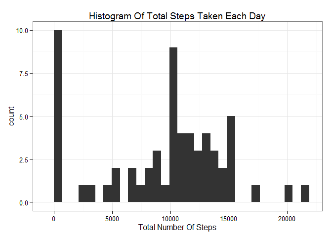
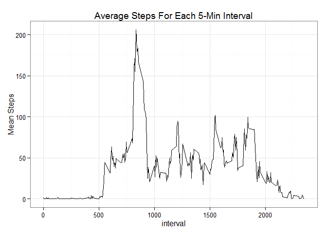
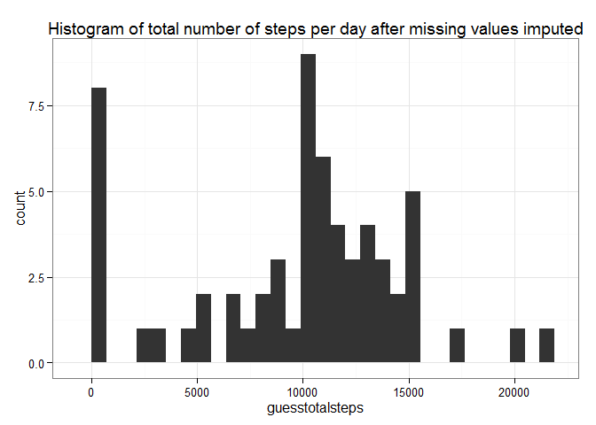
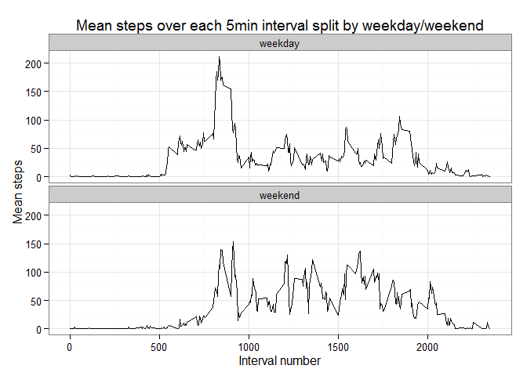

# Reproducible Research: Peer Assessment 1
Roman Prajapati  
January 10, 2016  


```r
#load package
library(ggplot2)
library(plyr)
```
##Loading and Preprocesssing the data(1. Code for reading in the dataset and/or processing the data)

```r
#Loading and preprocessing the data -- load csv file and transforming into suitable format
activity<-read.csv("activity.csv",colClasses=c("integer","Date","integer"))
```

```r
#Steps taken per day
stepsperday<-ddply(activity, c("date"),summarise,totalsteps=sum(steps,na.rm=TRUE))
```
#2. Mean and median number of steps taken each day

```r
#Calculate  the mean and median of the total number of steps taken per day              
activity_mean<- mean(stepsperday$totalsteps, na.rm=TRUE)
activity_median <- median(stepsperday$totalsteps)
```
#3. Histogram of the total number of steps taken each day

```r
#histogram of total steps taken each day
stepshist<-ggplot(stepsperday,aes(x=totalsteps))+geom_histogram()+
  xlab("Total Number Of Steps")+
  ggtitle("Histogram Of Total Steps Taken Each Day")+
  theme_bw()
print(stepshist)
```

```
## stat_bin: binwidth defaulted to range/30. Use 'binwidth = x' to adjust this.
```

\
##Average daily actiity pattern

```r
#Steps per 5 minute
stepsper5min<-ddply(activity, c("interval"),summarise,meansteps =mean(steps,na.rm=TRUE))
```
#4. Time series plot of the average number of steps taken

```r
#time Series Plot                   
activity_5min<-ggplot(stepsper5min,aes(x=interval,y=meansteps))+geom_line()+
  ggtitle("Average Steps For Each 5-Min Interval")+
  ylab("Mean Steps")+
  theme_bw()
print(activity_5min)
```

\
#5. The 5-minute interval that, on average, contains the maximum number of steps

```r
#Interval that contains maximum number of steps
max_interval<- stepsper5min[which(stepsper5min$meansteps==max(stepsper5min$meansteps)), "interval"]
```
##Imputing missing values

```r
#incomplete records
total_rows_with_NA<- nrow(activity)-sum(complete.cases(activity))
```
#6. Code to describe and show a strategy for imputing missing data

```r
#Strategy for filling in all missing values
#Interpolation is done by using the average of the previous valid observation and the next valid observation, or the average for the relevant 5-min interval if there is no valid #previous/next observation. This produces smooth activity-over-the-day lines for each #individual day, but is not very fast.
step_interpolation <- function(rownumber){
  prevrow=rownumber;
  nextrow=rownumber;
  while(is.na(activity$steps[prevrow])){
    prevrow=prevrow-1
    if(prevrow<1)return(mean(activity[activity$interval==activity$interval[rownumber],"steps"],na.rm=TRUE))
  }
  while(is.na(activity$steps[nextrow])){
    nextrow=nextrow+1
    if(nextrow>nrow(activity))return(mean(activity[activity$interval==activity$interval[rownumber],"steps"],na.rm=TRUE))
  }
  return(
    (activity$steps[prevrow]+activity$steps[nextrow])/2
  )
}

activity_guessNA <-activity
for(n in 1:nrow(activity)){
  if(is.na(activity$steps[n])){
    activity_guessNA$steps[n]=step_interpolation(n);
  }
}
```
#7. Histogram of the total number of steps taken each day after missing values are imputed

```r
#histogram of the total number of steps taken each day
new_stepsperday<-merge(
  ddply(activity_guessNA, c("date"),summarise,
        guesstotalsteps=sum(steps,na.rm=TRUE)
  ),
  stepsperday,
  by="date"
)
hist_perday<-ggplot(new_stepsperday,aes(x=guesstotalsteps))+
  geom_histogram()+
  ggtitle("Histogram of total number of steps per day after missing values imputed")+
  theme_bw()
print(hist_perday)
```

```
## stat_bin: binwidth defaulted to range/30. Use 'binwidth = x' to adjust this.
```

\
##New mean and median

```r
#for the NA-imputed data the mean is 
mean(new_stepsperday$guesstotalsteps,na.rm=TRUE)
```

```
## [1] 9707.219
```

```r
#for the NA-imputed data the median is
median(new_stepsperday$guesstotalsteps,na.rm=TRUE)
```

```
## [1] 10571
```
#We can see increment in mean and median.

##Are there differences in activity patterns between weekdays and weekends?

```r
#Create a new factor variable in the dataset with two levels - "weekday" and "weekend" #indicating whether a given date is a weekday or weekend day.

paindays= c("Monday","Tuesday","Wednesday","Thursday","Friday")
activity_guessNA$weekday<-as.factor(ifelse(weekdays(activity_guessNA$date)%in%paindays,"weekday","weekend"))

stepsperinterval.weekdaysplit<-ddply(activity_guessNA, c("interval","weekday"),summarise,
                    meansteps = mean(steps,na.rm=TRUE)
)
```
#8. Panel plot comparing the average number of steps taken per 5-minute interval across weekdays and weekends

```r
#Make a panel plot containing a time series plot (i.e. type = "l") of the 5-minute #interval (x-axis) and the average number of steps taken, averaged across all weekday days #or weekend days (y-axis).

weekdayplot<-ggplot(stepsperinterval.weekdaysplit,aes(x=interval,y=meansteps))+
  facet_wrap(~weekday,nrow=2,ncol=1)+
  geom_line()+
  theme_bw()+
  ggtitle("Mean steps over each 5min interval split by weekday/weekend")+
  ylab("Mean steps")+
  xlab("Interval number")
print(weekdayplot)
```

\
